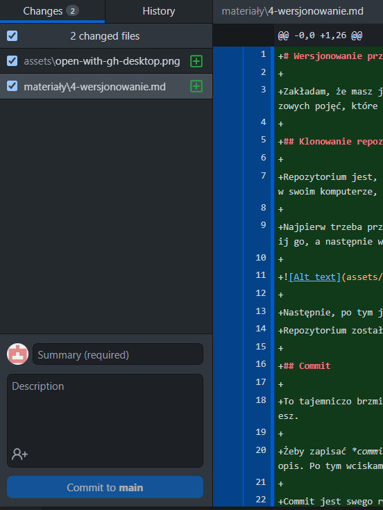
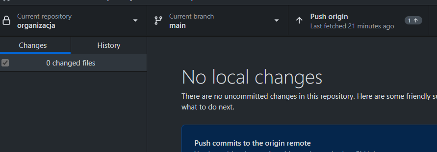

# Wersjonowanie przy użyciu Git i GitHub Desktop

Zakładam, że masz już pobrane programy Git i GitHub Desktop oraz konto na GitHubie. Wyjaśnię parę kluczowych pojęć, które warto sobie przyswoić, żeby swobodnie pracować z systemem kontroli wersji Git.

## Repozytorium lokalne i zdalne

Repozytorium jest, w najprostszym rozumieniu, zwykłym projektem. Żeby zacząć nad nim pracować lokalnie w swoim komputerze, trzeba je najpierw sklonować. GitHub Desktop nam tę robotę ułatwia.

Repozytorium zdalne (remote repository) znajduje się na stronie GitHub i mogą je widzieć wszyscy bądź każdy zaproszony do niego, w zależności od ustawień prywatności w nim.

Repozytorium lokalne (local repository) jest w twoich plikach i jest widoczne wyłącznie na twoim urządzeniu.

## Klonowanie repozytorium

Najpierw trzeba przejść na stronę repozytorium na GitHubie, gdzie znajdziesz zielony przycisk `Code`. Wciśnij go, a następnie w rozwiniętym menu wciśnij `Open with GitHub Desktop`.

Następnie, po tym jak już GitHub Desktop się otworzy, naciśnij niebieski przycisk `Clone`.  
Repozytorium zostało sklonowane, co oznacza, że możesz pracować nad nim lokalnie.

## Commit

To tajemniczo brzmiące słowo *commit* oznacza nic innego jak pojedyncza zmiana w kodzie, którą zapisujesz.

Żeby zapisać *commita* w GitHub Desktop, należy nadać mu nazwę (najlepiej czytelną) i - opcjonalnie - opis. Po tym wciskamy niebieski przycisk `Commit to main` na dole.

Commit jest swego rodzaju *checkpointem* w repozytorium, który pozwala na przykład na przejrzenie kodu zawartego w nim w momencie jego zapisania. System kontroli wersji pamięta wcześniejsze wersje i dzięki temu nic się nie stanie, jeśli usuniemy kod, który później się przyda.

## Push & pull

Poszczególne *commity* utworzone i zapisane lokalnie można wysyłać do repozytorium zdalnego, dzięki temu inni ludzie będą mogli zobaczyć twoje zmiany na GitHubie bądź je pobrać.

Wysyłanie commitów do repozytorium zdalnego nazywa się *pushowaniem* (push).
Robimy to poprzez przycisk w prawym górnym rogu:

Procesem do tego odwrotnym jest pull. Polega on na zaaktualizowaniu stanu lokalnego repozytorium poprzez pobranie wszyskich najnowszych commitów ze zdalnego repozytorium. Przeprowadza się go w ten sam sposób.

## Ścieżka do repozytorium lokalnego

Wszystkie repozytoria na twoim komputerze powinny być domyślnie zapisane w ścieżce `C:\Users\[twoja nazwa]\Documents\GitHub`.
