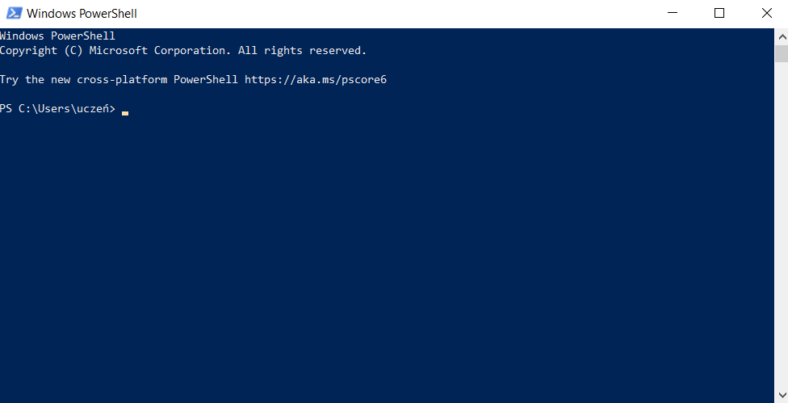
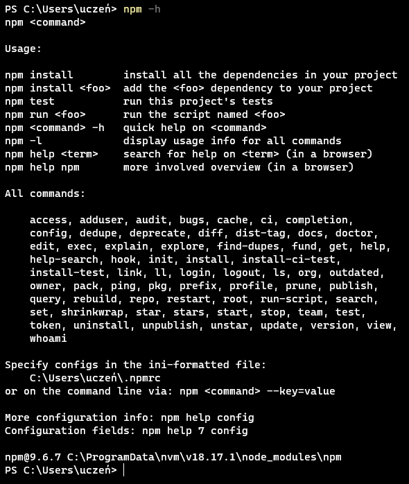

# Konsola - wstęp

## Wygląda groźnie, ale...

tak naprawdę to nic strasznego. Konsola będzie ważnym elementem pracy jako programista. Dzięki niej będziesz mógł robić zadania takie jak uruchamianie programów szybciej i wygodniej niż przy użyciu interfejsu graficznego (gdzie wchodzisz w interakcję poprzez np. naciskanie przycisków).  
Zaznajomienie się z konsolą nie jest niczym trudnym, ponieważ:

- wystarczy znać tylko jedną komendę systemową (cd),
- praktycznie wszystkie aplikacje działające w konsoli zawierają instrukcję, które wyjaśnia obsługiwane komendy,
- w trudnejszych przypadkach komenda będzie zwykle gotowa do skopiowania z internetu bądź znajdziesz tam bardziej rozbudowaną pomoc.

## Z czego mam korzystać?

Najprostszym programem jest `cmd.exe`, czyli "Wiersz polecenia". Wystarczy on do realizacji większości zadań programisty. Jednak jego funkcjonalność bywa ograniczona. Dlatego na systemie Windows polecam używać programu `Windows Powershell`, który jest wzbogacony o dodatkową funkcjonalość, jest również nieco wygodniejszy w użyciu.

Dla zwiększenia wygody polecam również pobrać aplikację `Windows Terminal` ze sklepu Microsoft Store. Windows Terminal ma następujące zalety nad zwykła konsolą:

- jest szerszy wybór konsol, które ma się do dyspozycji w tej aplikacji,
- można konfigurować ustawienia danej konsoli i wygląd,
- można mieć uruchomionych wiele konsol naraz.

Cmd:

Powershell:

Windows Terminal:

## cd - change directory

*Change directory* oznacza *zmień katalog*. Tą komendą będziesz mógł przechodzić po katalogach (folderach) w twoim komputerze. Większość komend, jakie wpisujesz, działa relatywnie do ścieżki, na której teraz jesteś.

Przykłady:

- `cd Documents` przechodzi do ścieżki `Documents`, o ile taka się znajduje w aktualnym katalogu,
- `cd C:\Users\[twoja nazwa]\Documents` robi to samo, ale możesz dostać się tam z każdego miejsca, ponieważ w komendzie jest ścieżka absolutna.
- `cd Documents\GitHub` przechodzi do ścieżki `Documents/GitHub`, o ile można z danego miejsca tam dojść.

W szczególności:

- ścieżka `.` oznacza aktualną ścieżkę, na której operuje konsola,
- ścieżka `..` oznacza ścieżkę do katalogu *poprzedniego*, zawierającego aktualny katalog

## Zewnętrzne programy

W większości zewnętrznych programów będą działać 2 komendy:
- `[program] -h` - pomoc, która bardzo się przyda w sytuacjach, gdy nie wiemy, jaką komendę wpisać,
- `[program] -v` - wyświetli numer wersji, który najczęściej jest potwierdzeniem, że program działa prawidłowo.

### VSCode

Zacznijmy od tego, że VSCode ma wbudowany terminal. Oznacza to, że podczas pracy z VSCode nie musisz korzystać z zewnętrznej konsoli, by uruchamiać programy. Jeśli uruchomisz program bezpośrednio w VSCode, dane wyjściowe pojawią się w konsoli VSCode właśnie.

Oprócz tego można uruchomić VSCode bardzo szybko z zewnętrznej konsoli wpisując `code` lub `code [ścieżka]`, gdzie `[ścieżka]` oznacza wybraną ścieżkę.

### npm

npm (Node Package Manager) to menedżer pakietów, czyli program służący do instalowania i zarządzania pakietami, czyli np. bibliotekami, które można pobrać, ale też naszym projektem.

Możesz wywołać wszystkie komendy w konsoli znajdując się w głównej ścieżce projektu:

| Komenda                   | Akcja                                                                        |
| :------------------------ | :--------------------------------------------------------------------------- |
| `npm install` / `npm i`   | Instaluje zależności, czyli wszelkie pakiety niezbędne do działania projektu |
| `npm run dev`             | Włącza lokalny serwer deweloperski pod adresem `localhost`                   |
| `npm run build`           | Buduje finalną wersję strony do katalogu `./dist/`                           |
