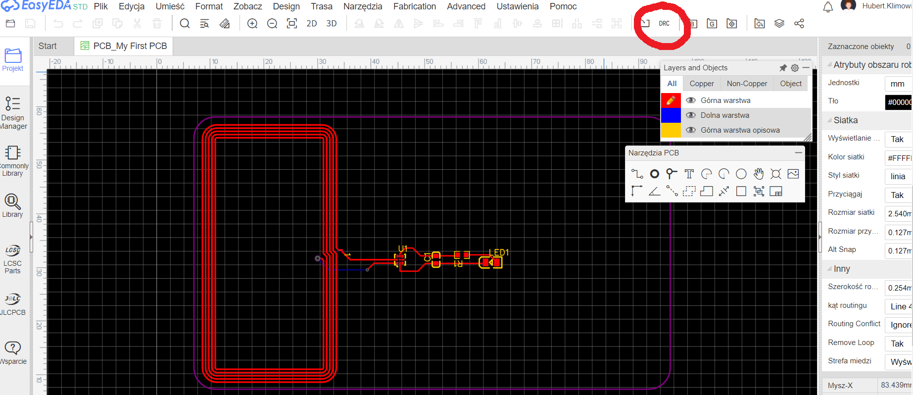
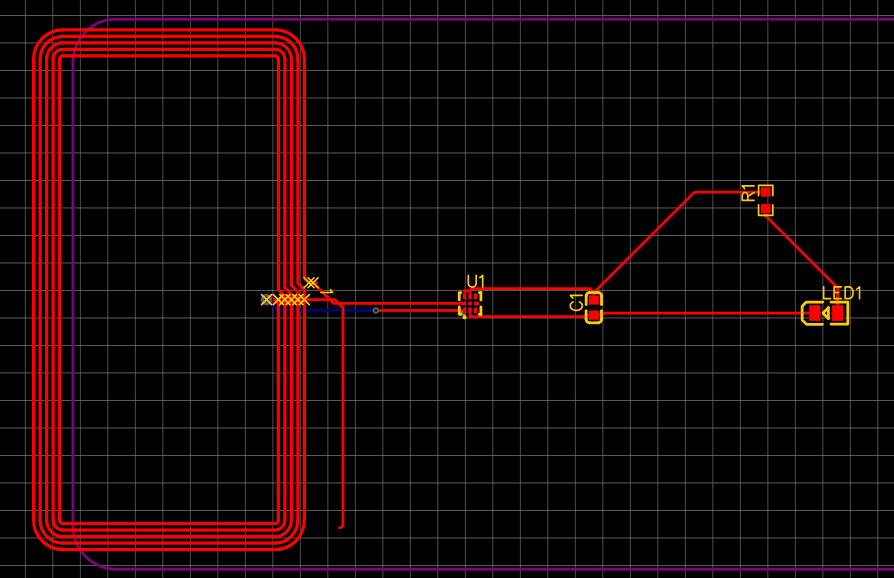
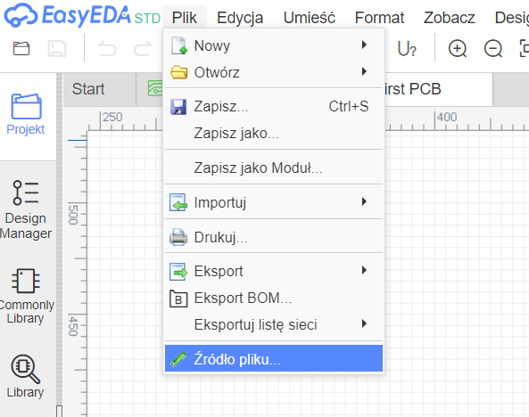
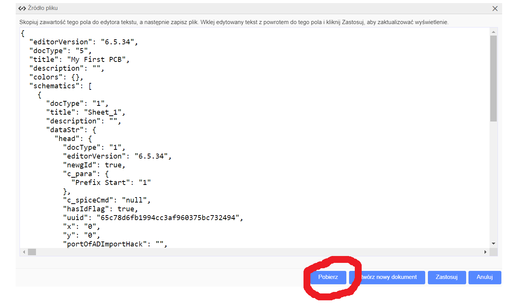
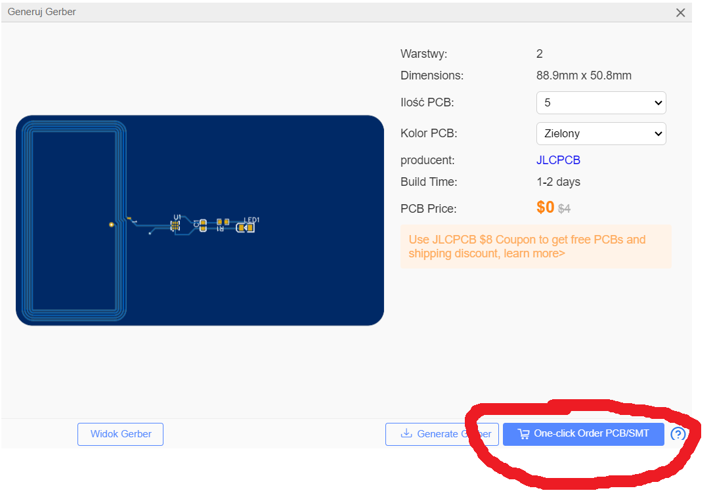
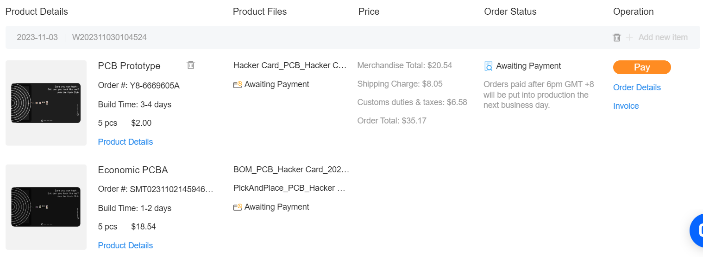
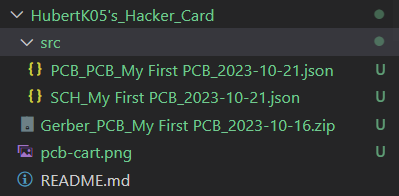
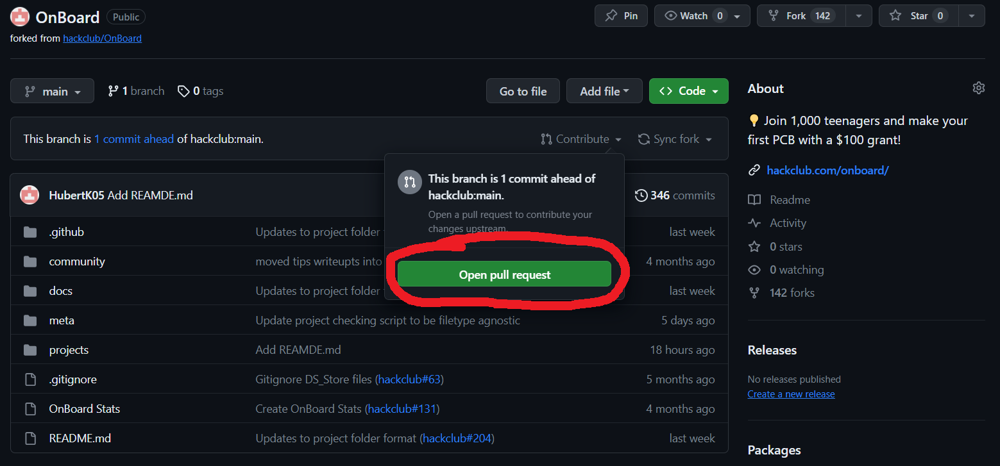

# Jak aplikować o grant OnBoard?
To będzie algorytm krok po kroku jak aplikować o grant HackClub (OnBoard) na płytki PCB.

## 0. Na co musisz być gotowy?

### Ograniczenia grantu:
- żeby zakup dało się sfinansować, należy być uczniem szkoły średniej,
- wartość grantu jest ograniczona do 100$,
- grant pokryje koszty płytki i dostawy, ale nie podatki i cła ze względu na skomplikowane procedury prawne.

## 1. Dołącz do Slacka
Jeśli jeszcze tego nie zrobiłeś, należy założyć konto na Slacku i dołączyć do HackClubu na Slacku. Nie ma tam żadnego procesu rekrutacyjnego, więc każdy może dołączyć w dowolnym momencie.

[Zrób to tutaj.](https://hackclub.com/slack/)

Po tym wejdź na kanał #onboard.

## 2. Upewnij się, że twoja płytka nie łamie zasad designu DRC
Żeby to sprawdzić, kliknij te przycisk w edytorze:

W tym projekcie powinny występować jedynie błędy na cewce/antenie. Uważaj na jeszcze jedną rzecz: pod cewką znajduje się jeszcze jedno połączenie, które się ukrywa. Możesz to zobaczyć, przesuwając cewkę w edytorze:

Po naprawieniu przesuń cewkę z powrotem na to samo miejsce.

## 3. Wygeneruj pliki Gerber i designu
Wróć na chwilę do schematu płytki (edytora z białym tłem). Wejdź w Plik > Źródło pliku, a w oknie kliknij "Pobierz".

Zrób dokładnie to samo z designem płytki (czarny edytor). Również tutaj pobierz plik opisujący płytkę (w ten sam sposób).
Po tym wygeneruj pliki Gerber. To są pliki opisujące płytkę, potrzebne do jej zakupu.

Po tym wchodzisz w opcję "No, generate Gerber", a następnie "Generate Gerber".

Żeby ukończyć ten krok, musisz posiadać:
- pliki Gerber (w formacie .zip)
- plik schematu (w formacie .json)
- plik płytki (w formacie .json)

## 4. Zrób screena z rozliczeń za zakup płytek

Następnie, dodaj wcześniej wygenerowane pliki Gerber. Dodaj ofertę do koszyka i wejdź na swój profil. **Pamiętaj, żeby zamówić 5 płytek - najmniejszą ich liczbę.**

Jeśli widzisz mniej więcej to, co na screenie, to trafiłeś dobrze, a następnym krokiem jest udanie się do "Secure Checkout".

**To będzie screen, który wyślesz do HackClubu, przedstawiający koszty do pokrycia przez grant.**

Wypełnij formularz własnymi danymi (nie jest to szczególnie istotne, ale precyzyjnie podaj adres, bo na jego podstawie będą naliczane koszty).

Wybierz metodę Global Standard Direct Line dla zminimalizowania kosztów. W przeciągu około 3 tygodni (12-16 dni roboczych) od zamównienia przesyłka będzie dostarczona.

Zanotuj, ile będzie kosztować płytka bez dostawy i z dostawą. **Zwróć uwagę na podatek i cło, które trzeba zapłacić z własnej kieszeni**.

Żeby zakończyć ten krok, będą ci potrzebne:
- screen przedstawiający płytki i koszty zamówienia,
- informacja o cenach płytki, o dostawie i wysokości cła.

## 5. Przygotuj się do dodania plików do repozytorium HackClub na GitHubie

[Wejdź na repozytorium OnBoard.](https://github.com/hackclub/OnBoard)

Tam znajdziesz opcję Fork. Fork to inaczej kopiowanie repozytoriów innych użytkowników na swoje konto, w celu uzyskania możliwości modyfikacji projektów innych osób. Końcowym etapem pracy nad forkiem jest tzw. *pull request*, czyli wysunięcie propozycji naniesienia zmian w oryginalnym projekcie innej osoby.

Po tym klonujesz forka (nie oryginalne repozytorium rzecz jasna) na swoje konto, gdzie możesz przeprowadzić zmiany. Robisz to przez zielony przycisk *Code* i otwarcie repozytorium przez GitHub Desktop.

## 6. Wypełnij pliki potrzebne do uzyskania grantu
Utwórz własny katalog w `projects` i zapełnij go wcześniej przygotowanymi plikami w taki sposób:

Co do pliku `README.md`, skopiuj plik `projects/!template/TEMPLATE.md` i wklej w swój katalog, zmieniając jego nazwę na `README.md`.
Ten skopiowany plik wypełnij swoimi danymi i przemyśleniami. Na pytanie "How much is it going to cost?" odpowiedz ceną płytki + ceną dostawy. Wklej https://jams.hackclub.com/jam/hacker-card jako link tutorialu.

**Pamiętaj, aby swoje zmiany scommitować i pushować. Możesz to zrobić poprzez GitHub Desktop.**

## 7. Otwórz pull requesta

Wejdź na GitHuba, na swoje sforkowane repozytorium, i znajdź ten przycisk:

Wypełnij checklistę, która się pojawi, wstawiając znak `x` w nawiasy kwadratowe. Upewnij się, że zrobiłeś wszystkie podane kroki. Zostanie jeszcze jedna rzecz do zrobienia, czyli verification form. Ten formularz weryfikacyjny jest potrzebny po to, żeby organizacja upewniła się, że jesteś uczniem szkoły średniej i żeby wiedziała, gdzie trzeba dostarczyć przesyłkę. Jako dowód uczęszczania do szkoły wyślij zdjęcie swojej legitymacji szkolnej z datą ważności, nazwą szkoły i imieniem i nazwiskem, **z danymi przetłumaczonymi na angielski**.

Możesz spojrzeć na treść pull requesta kilkająch przycisk *Preview* i jak wszystko się zgadza, wciśnij zielony przycisk "Create pull request".

## Koniec!
Od tego momentu bądź na bieżąco na GitHubie (tam, gdzie twój pull request), mailu i na kanale #onboard na Slacku.
